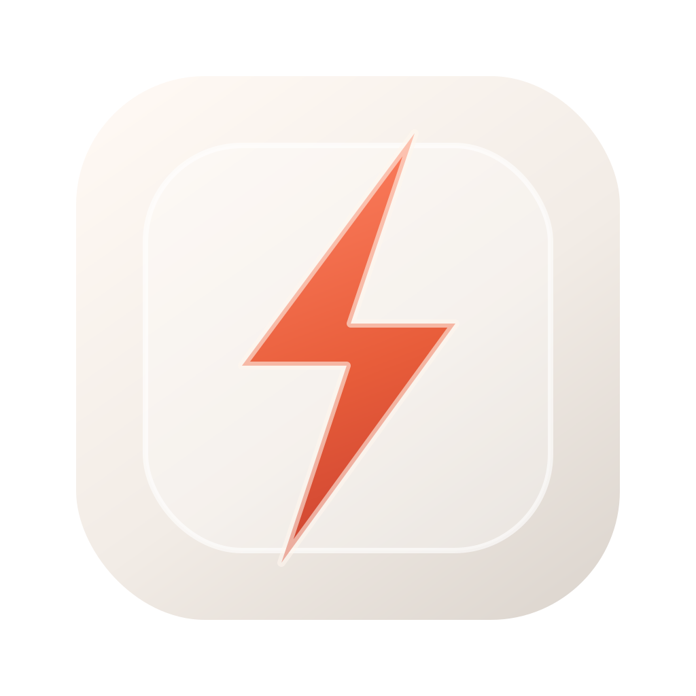

# QuickHacks

Small macOS system tweaks, one click away.

QuickHacks is a lightweight menu bar app for everyday Mac fixes that should
not require digging through settings or running Terminal commands. It helps you
clean up a crowded menu bar, keep your Mac awake, stop unwanted Bluetooth
devices from taking over audio, and run a few useful Finder/Dock toggles.

[Website](https://aslomon.github.io/quickhacks/) |
[Download](https://github.com/aslomon/quickhacks/releases/latest) |
[Changelog](CHANGELOG.md) |
[MIT License](LICENSE)



## What QuickHacks Does

- **Declutter the menu bar** - hide extra menu bar icons behind a separator.
- **Open menu bar apps from the panel** - keep the menu bar clean while still
  reaching third-party menu bar apps quickly.
- **Block Bluetooth takeovers** - disconnect blocked devices when they reconnect.
- **Keep Awake** - prevent display sleep for 15 minutes, 1 hour, 4 hours, or indefinitely.
- **Quick Toggles** - mute microphone, show hidden files, hide desktop icons,
  auto-hide the Dock, eject disks, and empty Trash.
- **Launch at login** - start QuickHacks automatically when your Mac starts.

QuickHacks is local-first. There is no account, no sync service, and no analytics.

## Download and Install

1. Download the latest ZIP from
   [GitHub Releases](https://github.com/aslomon/quickhacks/releases/latest).
2. Unzip it.
3. Move `QuickHacks.app` to your Applications folder.
4. Open `QuickHacks.app`.

Important: the first public GitHub builds are ad-hoc signed and not notarized
yet. macOS may warn that the developer cannot be verified. If that happens,
Control-click `QuickHacks.app`, choose **Open**, then confirm.

## Permissions Explained

macOS asks before apps can access sensitive system features. QuickHacks uses
permissions only for the features you choose:

- **Bluetooth** - lists paired devices and disconnects devices you block.
- **Accessibility** - opens other apps' menu bar items from the QuickHacks panel.
- **Finder Automation** - ejects disks and empties Trash.

Launch at login only works from the `.app` bundle, not from `swift run`.

## Build From Source

Requires macOS 14+ and Xcode command line tools.

```bash
git clone https://github.com/aslomon/quickhacks.git
cd quickhacks
./Scripts/build-app.sh
open build/QuickHacks.app
```

Development checks:

```bash
swift build
swift test
./Scripts/verify-launch.sh
```

Package a local release ZIP:

```bash
./Scripts/package-release.sh
```

Regenerate the app icon:

```bash
./Scripts/generate-icons.sh
```

## Architecture

QuickHacks is a native SwiftUI and AppKit macOS app with no third-party
dependencies.

```text
Sources/QuickHacks/
  App/        entry point, status items, and custom panel controller
  Design/     design tokens documented in DESIGN.md
  Services/   one main-actor service per feature
  Views/      SwiftUI panel UI
```

Platform notes:

- Other apps' status window bounds are masked by macOS without Screen Recording
  permission, so QuickHacks opens menu bar apps through Accessibility actions
  instead of coordinate clicks.
- The declutter separator never collapses automatically on launch and refuses
  to collapse if QuickHacks' own menu bar items are arranged in an unsafe order.
- Shell-based toggles are isolated in `ShellRunner`, which applies a timeout so
  failed commands surface as inline errors instead of hanging indefinitely.

## Public Release Status

The current GitHub release ZIP is intended for early public use and testing.
Before broader direct distribution, QuickHacks still needs Developer ID signing
and notarization. See [RELEASE.md](RELEASE.md) for the release checklist.

For a Mac App Store build, the shell-based toggles need sandbox-safe
replacements or store-specific feature flags.

## License

QuickHacks is available under the [MIT License](LICENSE).
